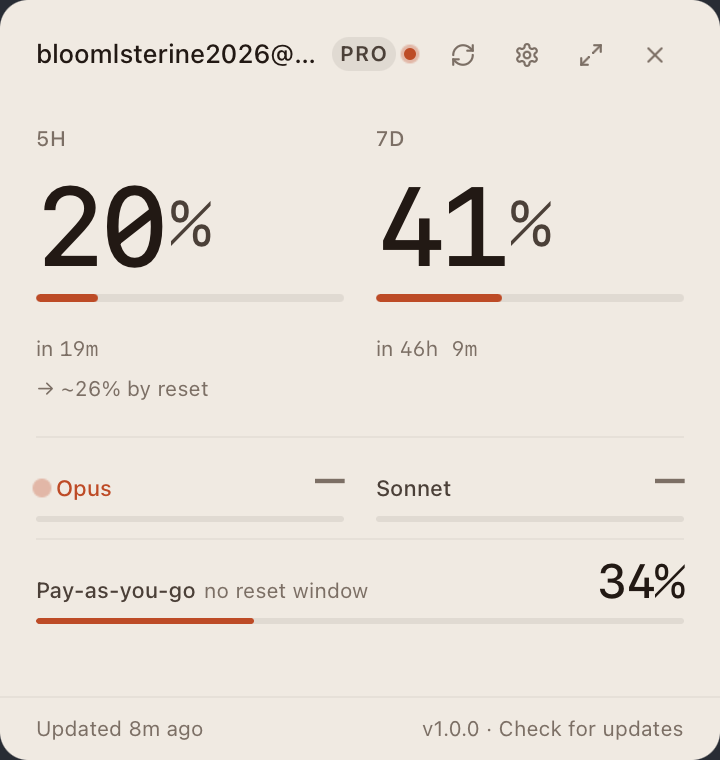
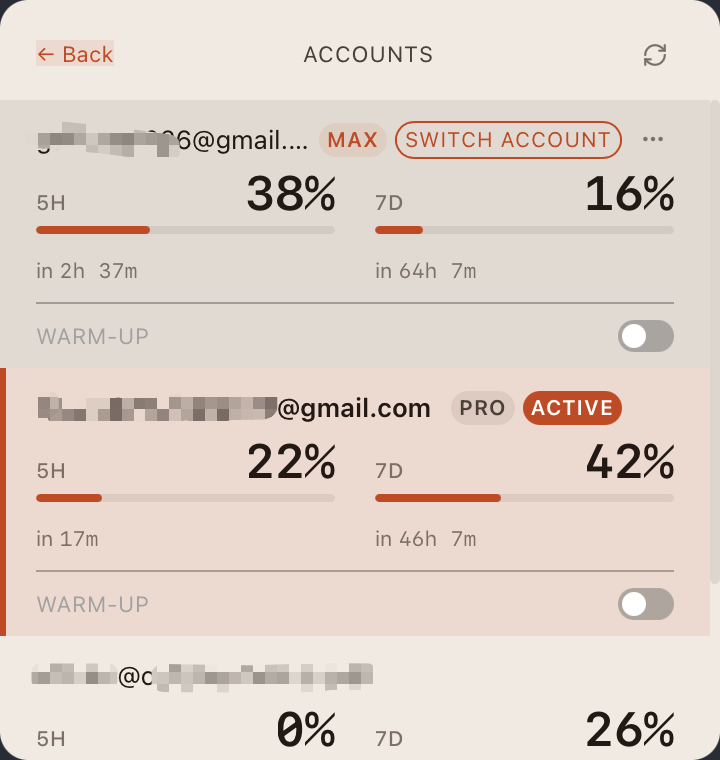
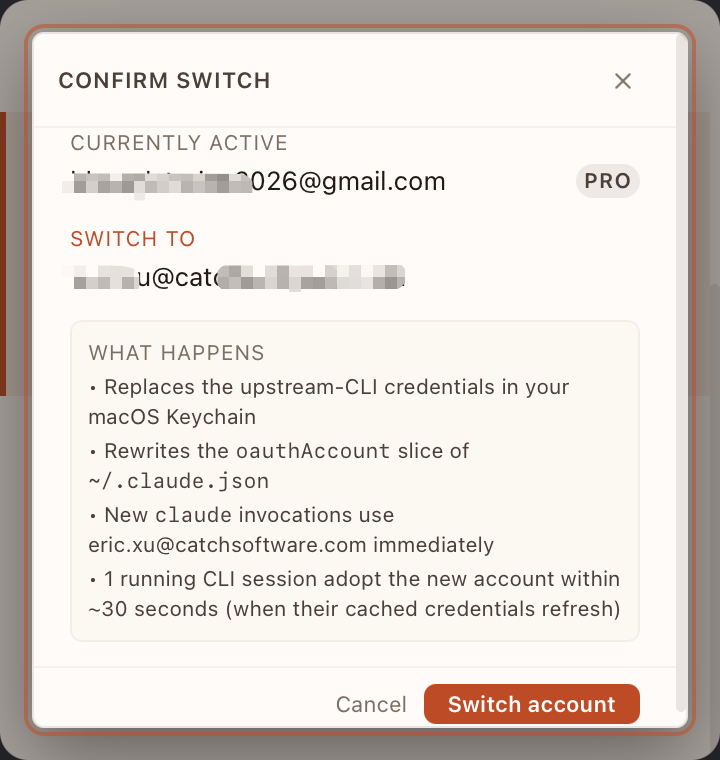
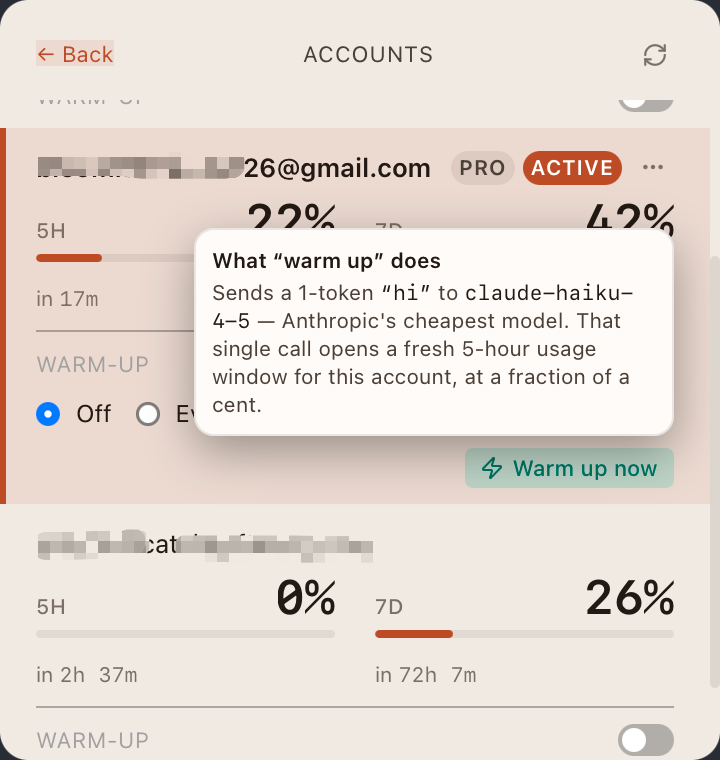
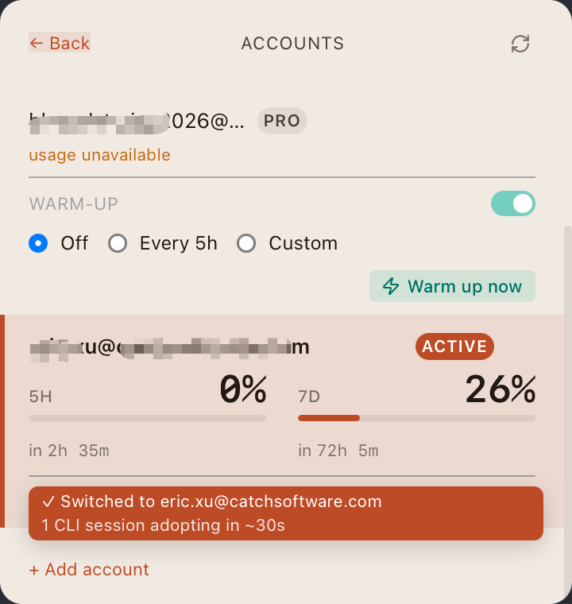
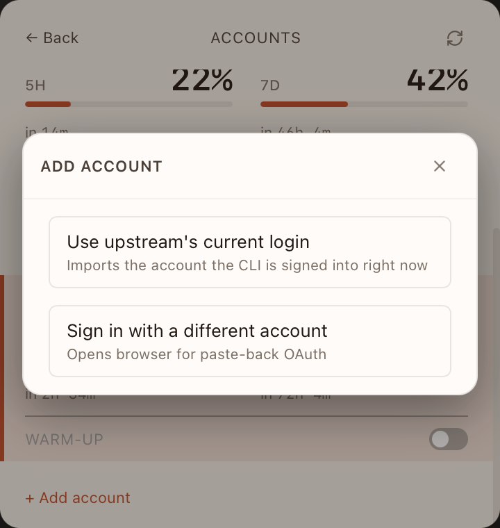
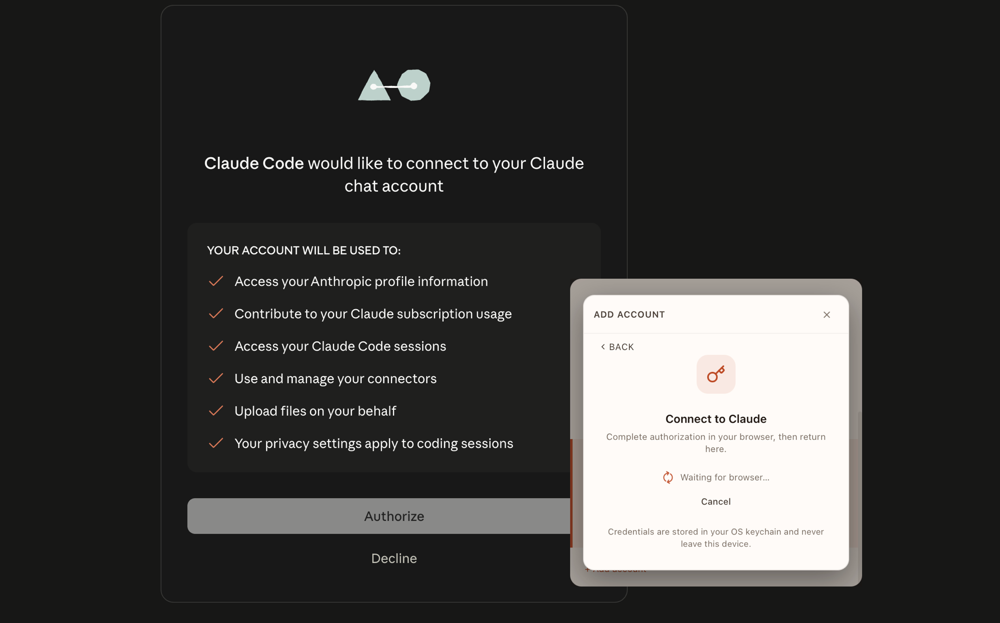
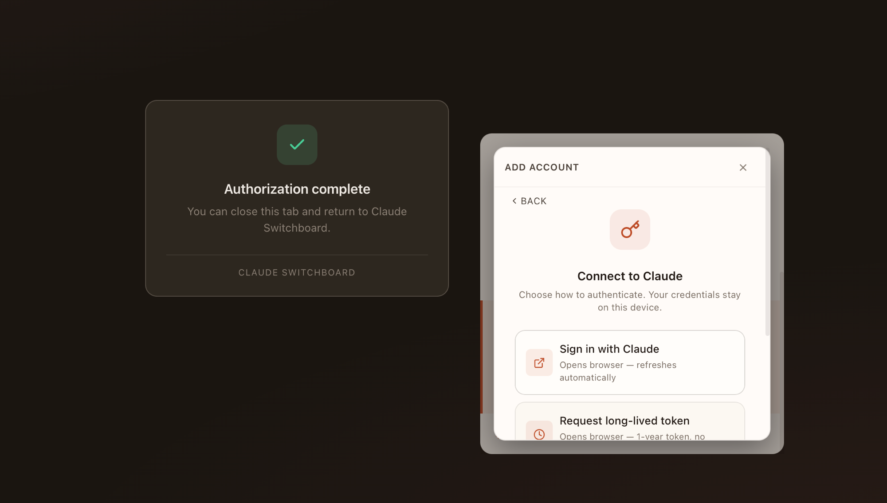

# Claude Switchboard

**Know where you stand. Switch who's signed in. Decide when your 5-hour window starts. All from your menu bar.**

Switchboard is a native menu-bar control plane for your Claude rate limits and accounts. One glance tells you what's left in the 5-hour and 7-day windows. One click swaps which account Claude Code is using. One toggle starts a fresh 5-hour bucket on your schedule, not whenever you happened to fire your first prompt.

<p align="center">
  
</p>

---

## Glance, don't query

**Your 5-hour utilization stays in peripheral vision.**

A ring around the menu-bar icon shows live percentage. Hover for a one-line summary; click for the popover. No window to open, no command to run.

<p align="center">
  
  &nbsp;&nbsp;
  
</p>

The compact popover gives you everything you need to decide "can I keep coding?" in under a second:

- **5H / 7D bars** with absolute reset times (`in 19m`, `in 46h 9m`) — never math-on-the-fly
- **Burn-rate projection** — `→ ~26% by reset` extrapolates from your current pace
- **Per-model bars** — see Opus vs Sonnet split at a glance
- **Pay-as-you-go credits** — when enabled, with its own utilization bar

---

## One menu, every account

**Manage as many Claude accounts as you have. See them all stacked, ranked by tier, with the active one highlighted.**

<p align="center">
  
</p>

Every account row carries its own polled usage — so before you switch, you can see which account has runway. The active account is highlighted in warm orange; tier badges (`MAX`, `PRO`) are pulled live from Anthropic on every poll, so a plan upgrade is reflected within one tick.

---

## Switch who's signed in — without restarting Claude Code

**One click rewrites the OS-level credentials. Running CLI and VS Code sessions adopt the new account within ~30 seconds.**

<p align="center">
  
</p>

The confirm dialog tells you exactly what's about to change — Keychain entry, `~/.claude.json` slice, which account new `claude` invocations will use, and how long running sessions take to pick up the swap. No mystery, no manual file editing.

A 60-second `KeychainGuardian` covers the narrow race where a Claude Code process started its OAuth refresh just before the swap, so the swap can't be silently overwritten.

---

## Start your 5-hour window when *you* want it

**A 1-token Haiku ping at 8am gives you a window that resets at 1pm — aligned to your workday instead of trailing into the evening.**

<p align="center">
  
</p>

Warm-up is **strictly opt-in** per account, with a one-time consent dialog the first time you enable it on any account. Cost is rounding-error against your subscription (≈$0.000007 per fire, ≈$0.013/year on a 5-fires-a-day cadence). If the account already has an active 5-hour window from your normal coding, warm-up is a no-op — it skips the HTTP call entirely.

<p align="center">
  
</p>

Three preset shapes:

- **Off** — manual only.
- **Every 5h** — pick an anchor (e.g. 06:00) and the app fires at 06:00, 11:00, 16:00, 21:00.
- **Custom** — explicit list of `HH:MM` times.

Schedules fire via the OS (launchd on macOS, Task Scheduler on Windows) so they work even when the app is closed. Prefer not to register an OS agent? The in-app scheduler still fires while the app is open.

---

## Onboard in seconds

**Import the account `claude` is already signed into, or sign in fresh — either way, two clicks.**

<p align="center">
  
</p>

For accounts you haven't logged into with `claude` yet, Switchboard runs a standard OAuth flow with a local-redirect paste-back. The browser handles the Anthropic consent screen; the app waits.

<p align="center">
  
</p>

<p align="center">
  
</p>

Credentials live in your OS keychain. They never leave the device. Switchboard never logs in on your behalf — it only reads tokens your OS already holds and uses them against `api.anthropic.com`.

---

## Also on Windows

**Same layout, same interactions, same design language. Rendered with Mica on Windows 11 and a translucent fallback on Windows 10.**

<p align="center">
  
  &nbsp;&nbsp;
  
</p>

<p align="center">
  
</p>

The full report has six tabs — Sessions, Models, Trends, Projects, Heatmap, Cache — sourced from your local Claude Code JSONL transcripts.

<p align="center">
  
</p>

<p align="center">
  
</p>

---

## Why this and not the other tools

| | Switchboard | Read-only usage viewers |
|---|---|---|
| **Glance value** | Ring badge in the menu bar | Open an app to find out |
| **Multi-account** | First-class, with one-click swap | Single-account or static list |
| **Account switching** | Rewrites OS creds; sessions adopt in ~30s | Not supported — restart Claude Code |
| **Window control** | Warm-up to start the 5H bucket on your schedule | None — bucket starts at first prompt |
| **Tier-aware cost** | Sonnet 4 1M-context tier + 5m/1h cache writes calculated correctly | Often approximated |
| **Cross-platform** | macOS + Windows 10/11, same design | Usually macOS-only |
| **Privacy** | Local-only. No telemetry. | Varies |

---

## Features at a glance

- **Live tray badge** — 5-hour percentage as a ring around the menu-bar icon
- **Multi-account, one-click swap** — every account in one popover, click to switch, running sessions adopt in ~30s
- **Burn-rate projection** — extrapolates your pace and color-cues against your threshold
- **Threshold notifications** — warn / danger levels you choose; one alert per bucket cycle
- **Six-tab expanded report** — Sessions, Models, Trends, Projects, Heatmap, Cache
- **Tier-aware cost math** — Sonnet 4's 1M-context tier and the 5-minute / 1-hour cache write split
- **Warm-up & scheduling** — manual or OS-scheduled, strictly opt-in, ~$0.013/account/year
- **Auto-update** — checks every 6h, signed with ed25519, single-click install
- **Cross-platform** — macOS (vibrancy) and Windows 10/11 (Mica / acrylic)

---

## Install

No signed release yet — build from source:

```bash
pnpm install
pnpm tauri dev
```

When binaries ship, first-launch notes for unsigned apps:

- **macOS:** `xattr -d com.apple.quarantine "/Applications/Claude Switchboard.app"` or right-click → Open from Finder.
- **Windows:** SmartScreen → "More info" → "Run anyway". WebView2 is required on Windows 10 (Windows 11 ships it).

## Updates

Switchboard checks for new versions automatically — on launch and every 6 hours while running. When an update is downloaded and ready, a banner appears at the top of the popover with an **Install & restart** button. You can also trigger a check manually from the popover footer or the tray menu.

**Important:** Auto-update was added in **v0.2.0**. If you're upgrading from v0.1.x, download and install v0.2.0 manually from the [releases page](https://github.com/FeiXu-1131372/claude-switchboard/releases) — the v0.1.x build has no updater wired up. Every release after v0.2.0 auto-updates.

The app is unsigned (no Apple Developer ID / Windows EV cert), so the *first install* on a new machine goes through the OS-specific first-launch flow above. After that, updates are silent — Gatekeeper and SmartScreen don't re-check signed-by-the-same-developer apps on update.

Update integrity: every release artifact is signed with our ed25519 updater key, and the app refuses any update whose signature doesn't match the embedded public key.

## Authentication & multi-account

Switchboard manages as many Claude accounts as you have. Each account lives in its own slot with its own polled usage; the **Accounts** sub-screen shows all of them stacked, with the currently-active one highlighted. Every slot has a **Switch account** button — click it to make Claude Code (CLI and the VS Code extension) point at that account.

Two ways to add an account:

1. **Import the upstream login** — sign in with `claude login` first, then in Switchboard hit "Use upstream's current login". Captures the live credentials in one click.
2. **OAuth in-app** — opens a local-redirect OAuth flow. Useful for adding accounts you haven't logged into via `claude` yet.

The app never logs in on your behalf. It only reads tokens your OS already holds and uses them against `api.anthropic.com`.

**Hot reload, not restart.** A swap rewrites the OS-level credentials atomically — running Claude Code sessions pick up the new account within ~30 seconds (Claude Code's own keychain cache TTL on macOS, one API tick on Windows). A 60-second `KeychainGuardian` protects against the narrow race where a Claude Code process started its OAuth refresh just before the swap.

## Warm-up & scheduling

Switchboard can deliberately start an account's 5-hour rolling window so its reset time is known and predictable — useful when rotating across multiple accounts. **Off by default per account; strictly opt-in.**

The first time you enable warm-up on any account, a one-time consent dialog explains exactly what gets sent. Per-account toggle and global revoke are available in Settings at any time.

A warm-up sends a 1-token Haiku request to `api.anthropic.com/v1/messages` using the account's existing OAuth credentials — the same surface Claude Code uses. Cost is rounding-error against your subscription (≈$0.000007 per fire, ≈$0.013/year on a 5-fires-a-day cadence). If the account already has an active 5-hour window from your normal coding, warm-up is a no-op.

## Migrating from Claude Limits (v0.3.x)

If you previously used Claude Limits, install Switchboard from the releases page and launch it once. It will:

1. Detect your existing v0.3.x data directory at `~/Library/Application Support/com.claude-limits.ClaudeLimits/`.
2. Quit any running Claude Limits process.
3. Copy your usage history, accounts, and settings to the new directory.
4. Remove the legacy launch-at-login entry (if you had it enabled) and re-register under the new bundle ID.
5. Show a one-time welcome dialog summarizing what migrated.

Your old install is preserved — you can launch the legacy `Claude Limits.app` to fall back at any time. After ~3 months of stable Switchboard use, the app will offer a "tidy old data" button.

## Privacy

- All data stays on your machine. Usage history is in SQLite at `~/Library/Application Support/com.claude-switchboard.ClaudeSwitchboard/data.db` (macOS) or the platform equivalent on Windows.
- The only outbound traffic is to Anthropic's official API.
- No telemetry, no analytics, no third-party services.
- **Opt-in warm-up:** With your explicit per-account consent, Switchboard can send 1-token warm-up messages to `/v1/messages` to start the 5-hour window deliberately. No other content is ever sent. Off by default; revocable any time.

## Stack

Tauri v2 (Rust + WebView) · React 19 · TypeScript · Tailwind CSS v4 · Framer Motion · Recharts · SQLite.

## Development

```bash
# Frontend typecheck
pnpm exec tsc --noEmit

# Backend tests (75+ unit + integration tests)
cd src-tauri && cargo test
```

## License

MIT
